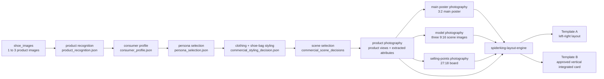

# SpiderKing Parallel Brand Card Workflow

Use this Skill as the master workflow for the confirmed SpiderKing visual production system.

The workflow is dependency-based and must run in this order:

1. Product Recognition: run the image-free recognition phase of `spiderking-product-vision` and approve `product_recognition.json`.
2. Consumer Profile: run `spiderking-commercial-visual-stylist` and approve `consumer_profile.json`.
3. Persona Selection: select and approve `persona_selection.json` from the built-in human persona database.
4. Clothing Styling: define upper, lower, outerwear, silhouette, color, and materials.
5. Shoe-Bag-Accessory Styling: validate the shoe-led outfit, bag, watch, jewelry, hat or hair detail, and personal charms; approve `commercial_styling_decision.json`.
6. Scene Selection: run `spiderking-commercial-scene-director` for every image containing an environment and approve each `commercial_scene_decision*.json`.
7. Commercial Photography Generation: render Product Vision, then run three production branches in parallel:
   - `spiderking-copywriting`
   - `spiderking-styling-engine`
   - `spiderking-selling-points`
8. Final Layout: run `spiderking-layout-engine` to output two final template images. Invoke both directors again only if Layout Engine must generate new visual content.

## Required Input

- `shoe_images`: 1 to 3 original product image paths, URLs, or attachment references.
- Optional `optional_product_hint`: product name, model, category, target customer, season, campaign theme, or selling direction.

The SpiderKing logo is not required as runtime input. The downstream poster and layout Skills own the built-in uploaded logo assets:

- `~/.codex/skills/spiderking-copywriting/assets/spiderking-logo.jpg`
- `~/.codex/skills/spiderking-layout-engine/assets/spiderking-logo.jpg`

## Global Hard Rules

- Use two explicit generation routes. Product-only white-background assets follow `商品识别 -> 结构一致性分析 -> 角度与数量规划 -> 白底商业化生成 -> 一致性质检`.
- Images containing a person, lifestyle environment, advertising scene, or scenario storytelling must obey `商品识别 -> 消费者画像 -> 人物选择 -> 服装搭配 -> 鞋包搭配 -> 场景选择 -> 商业摄影生成` without reordering, merging, or skipping stages.
- Do not create consumer, persona, styling, or scene files filled only with `not_applicable` for a product-only white-background render. Those gates begin only when the workflow enters commercial human or scene imagery.
- Do not select a consumer, person, outfit, bag, accessory, or scene before `product_recognition.json.status` is `approved`.
- Do not merge consumer profile and person selection into a generic model prompt. Preserve `consumer_profile.json` and `persona_selection.json` as separate auditable outputs.
- Before every image-generation or image-editing call, invoke or revalidate `spiderking-commercial-visual-stylist` and load its detailed framework.
- Before every image-generation or image-editing call that creates or changes a scene, invoke `spiderking-commercial-scene-director` and load its commercial scene database.
- Select every human subject through the persona chain: product price band -> target consumer -> purchase decision-maker -> actual user -> use scene -> persona ID. Do not default to a young female model.
- Do not call ChatGPT image generation unless `commercial_styling_decision.json.status` is `approved` and all applicable pre-generation checks pass.
- Do not generate a scene unless the matching `commercial_scene_decision*.json.status` is `approved`.
- Select scenes in this order: product, consumer, use context, brand feeling, then location, space, architecture, time, light, action, and camera.
- Complete the required order: person, brand, product, scene, clothing, footwear, bag, accessories, color, materials, pose/camera, and commercial optimization.
- Product function controls scene and styling before fashion decoration. Do not reduce hiking, trail, business, or other specialized footwear to generic sports styling.
- Separate visible evidence from inference and block unsupported functional claims.
- All image generation, image editing, or AI-created visual content must use ChatGPT image generation only.
- Do not use Midjourney, Stable Diffusion, ComfyUI, Gemini image generation, reverse-engineered image tools, or any other image model.
- Treat the original shoe images as the single product truth.
- Preserve the shoe one-to-one across every generated module: shape, sole, upper structure, color, materials, stitching, logo, laces, decorative details, and proportions.
- If image quality or visual drama conflicts with shoe consistency, protect shoe consistency first.
- Do not hardcode outputs from any previous product.
- Stop and regenerate a branch before layout if the shoe drifts, the logo is redrawn, the model hides the shoe, or the required aspect ratio is wrong.
- Final layout should use approved upstream images directly when possible, preserving original image quality instead of asking AI to redraw the full card.

## Parallel Workflow



## Stages 1-6: Commercial Planning Gates

### Stage 1: Product Recognition

Run `SpiderKingProductVision.recognize({ shoe_images, optional_product_hint })` without calling an image model.

Output and gate:

- `product_recognition.json`
- `extracted_attributes.json`
- Stop if source images conflict, classification is generic despite specialized evidence, or unsupported claims are not excluded.

### Stage 2: Consumer Profile

Run `spiderking-commercial-visual-stylist` with the approved product recognition.

Output and gate:

- `consumer_profile.json`
- Record price band hypothesis, target consumer, purchase decision-maker, actual user, age, occupation or family identity, purchasing power, motivations, pain points, desired lifestyle, and credible use contexts.

### Stage 3: Persona Selection

Read the built-in human persona database and select an exact persona ID or justified `EXT-*` persona.

Output and gate:

- `persona_selection.json`
- Reject a person chosen only for youth or attractiveness. The person must credibly represent the consumer, user, or purchase decision-maker.

### Stages 4-5: Clothing and Shoe-Bag Styling

Build clothing first, then validate footwear-led outfit logic and select bag and accessories.

Output and gate:

- `commercial_styling_decision.json`
- Require approved silhouette balance, shoe prominence, bag logic, accessory hierarchy, 60/30/10 color plan, material compatibility, and product visibility.

### Stage 6: Scene Selection

Run `spiderking-commercial-scene-director` after persona and styling approval.

Output and gate:

- `commercial_scene_decision_main.json`
- `commercial_scene_decision_01.json`, `commercial_scene_decision_02.json`, `commercial_scene_decision_03.json`
- 3 to 4 additional approved scene decisions for scenario cards when needed.

## Stage 7: Commercial Photography Generation

First render Product Vision through its product-only white-background route and pass its consistency review:

- `side_view.png`: 3:2 side view, one single shoe.
- `hero_45_view.png`: 3:2 45-degree view, one pair of shoes.
- `top_view.png`: 3:2 top view, one pair of shoes.
- `product_vision_preview.png`: polished three-view product preview.

After Product Vision photography passes, run the following three branches concurrently.

### Branch A: Main Poster

Run `spiderking-copywriting`.

Input:

- `extracted_attributes.json`
- `commercial_styling_decision.json`
- `commercial_scene_decision_main.json`
- `product_vision_preview.png` or original `shoe_images`
- optional `optional_product_hint`
- built-in SpiderKing logo

Output:

- `main_poster_3x2.png`
- `main_poster_copywriting.json`

Work:

- Generate a 3:2 horizontal commercial poster.
- Use the approved human persona from `commercial_styling_decision.json`; the model or family group must credibly represent the target consumer, user, or purchase decision-maker.
- Select representative scene based on product style, try-on context, and selling points.
- Add outfit, accessories, jewelry, hair accessories, necklace, brooch/charms, and style-consistent bag.
- Include SpiderKing logo, main title, core selling points, and new-arrival badge.

### Branch B: Three 9:16 Styling Scenes

Run `spiderking-styling-engine`.

Input:

- `extracted_attributes.json`
- `commercial_styling_decision.json`
- `commercial_scene_decision_01.json`, `commercial_scene_decision_02.json`, `commercial_scene_decision_03.json`
- key selling points from Product Vision or Branch A if available
- original `shoe_images` or validated product reference
- optional `optional_product_hint`

Output:

- `scene_model_01.png`
- `scene_model_02.png`
- `scene_model_03.png`
- `styling_spec.json`

Work:

- Generate exactly three separate 9:16 model scene images.
- Use the approved persona ID or documented persona variation from `commercial_styling_decision.json`.
- All models must be standing.
- Standing pose, body direction, outfit, makeup, hairstyle, accessories, bag, scene material, background, and camera perspective must not repeat.
- Each image includes professional atmospheric scene-title typography.

### Branch C: Selling Points Board

Run `spiderking-selling-points`.

Input:

- `extracted_attributes.json`
- `commercial_styling_decision.json`
- 3 to 4 approved `commercial_scene_decision_*.json` files for scenario cards
- `shoe_images` or validated Product Vision output
- optional key selling points
- optional `optional_product_hint`

Output:

- `selling_points_board_27x18.png`
- `selling_points_manifest.json`

Work:

- Generate one 27:18 horizontal selling-points board.
- Include three sections:
  - visual selling points;
  - functional selling points;
  - scenario selling points.
- Scenario selling points use 3 to 4 horizontal rectangular scene-only images in a vertical stacked layout.
- Scenario cards must not include models, legs, feet, or shoes.

## Stage 8: Final Layout

Run `spiderking-layout-engine` after all three parallel branches complete.

Input:

- `main_poster_3x2.png`
- `product_vision_preview.png`
- `scene_model_01.png`
- `scene_model_02.png`
- `scene_model_03.png`
- `selling_points_board_27x18.png`
- built-in SpiderKing logo
- `commercial_styling_decision.json` only when new image content must be generated
- matching `commercial_scene_decision.json` when a new environment must be generated

Output:

- `final_brand_card_template_a.png`
- `final_brand_card_template_b.png`
- `layout_manifest.json`

Work:

- Template A: left-right business card layout.
  - Left upper: main poster.
  - Left lower: three scene model images.
  - Right upper: product vision.
  - Right lower: selling-points board.
- Template B: approved vertical integrated card layout.
  - Follow the approved reference image style:
    `/Users/chuchu/.codex/generated_images/019f0691-3b5c-7010-aff9-07647e7f0d97/ig_03cefcbc1441eb47016a3f49cfd1a8819998893d2df5377698.png`
- Preserve upstream image quality. Do not unnecessarily redraw approved module images.

## Final Package

Create or return a package containing:

- `final_brand_card_template_a.png`
- `final_brand_card_template_b.png`
- `product_vision_preview.png`
- `main_poster_3x2.png`
- `scene_model_01.png`
- `scene_model_02.png`
- `scene_model_03.png`
- `selling_points_board_27x18.png`
- `extracted_attributes.json`
- `product_recognition.json`
- `consumer_profile.json`
- `persona_selection.json`
- `commercial_styling_decision.json`
- `commercial_scene_decision_main.json`
- `commercial_scene_decision_01.json`, `commercial_scene_decision_02.json`, `commercial_scene_decision_03.json`
- `main_poster_copywriting.json`
- `styling_spec.json`
- `selling_points_manifest.json`
- `layout_manifest.json`
- `brand_card_system_manifest.json`

## `brand_card_system_manifest.json` Schema

```json
{
  "system_name": "SpiderKing Parallel Brand Card Image System",
  "image_backend": "ChatGPT image generation",
  "source_inputs": {
    "shoe_images": [],
    "optional_product_hint": ""
  },
  "brand_asset_refs": {
    "copywriting_logo": "~/.codex/skills/spiderking-copywriting/assets/spiderking-logo.jpg",
    "layout_logo": "~/.codex/skills/spiderking-layout-engine/assets/spiderking-logo.jpg"
  },
  "workflow": {
    "stage_1_product_recognition": ["spiderking-product-vision.recognize"],
    "stage_2_consumer_profile": ["spiderking-commercial-visual-stylist"],
    "stage_3_persona_selection": ["spiderking-commercial-visual-stylist"],
    "stage_4_5_styling": ["spiderking-commercial-visual-stylist"],
    "stage_6_scene_selection": ["spiderking-commercial-scene-director"],
    "stage_7_product_photography": ["spiderking-product-vision.render"],
    "stage_7_parallel_photography": [
      "spiderking-copywriting",
      "spiderking-styling-engine",
      "spiderking-selling-points"
    ],
    "stage_8_layout": ["spiderking-layout-engine"]
  },
  "final_outputs": {
    "template_a": "final_brand_card_template_a.png",
    "template_b": "final_brand_card_template_b.png"
  },
  "intermediate_assets": {
    "product_recognition": "product_recognition.json",
    "consumer_profile": "consumer_profile.json",
    "persona_selection": "persona_selection.json",
    "commercial_styling_decision": "commercial_styling_decision.json",
    "commercial_scene_decisions": [],
    "product_vision": "product_vision_preview.png",
    "main_poster": "main_poster_3x2.png",
    "scene_models": [
      "scene_model_01.png",
      "scene_model_02.png",
      "scene_model_03.png"
    ],
    "selling_points": "selling_points_board_27x18.png"
  },
  "stage_outputs": {},
  "shoe_consistency_checks": [],
  "status": "complete"
}
```

## Stage Gates

After each stage or parallel branch, verify:

- Required image and JSON outputs exist.
- Stage order is preserved: product recognition -> consumer profile -> persona selection -> clothing styling -> shoe-bag-accessory styling -> scene selection -> commercial photography -> layout.
- `product_recognition.json`, `consumer_profile.json`, and `persona_selection.json` each exist and have `status: approved` before styling or image generation.
- Aspect ratios match each Skill:
  - Product Vision: 3:2 product views.
  - Main Poster: 3:2.
  - Styling Scenes: three separate 9:16 images.
  - Selling Points: 27:18.
  - Layout: two final template images.
- `image_backend` is `ChatGPT image generation`.
- `commercial_styling_decision.json.status` is `approved` before each generated image.
- Every environment image has a matching approved `commercial_scene_decision*.json`.
- Product, consumer, use context, brand feeling, space, architecture, time, light, action, and camera logic are recorded.
- Person, brand, product, scene, clothing, footwear, bag, accessories, color, material, pose, and commercial checks are recorded when applicable.
- Shoe consistency checklist passes.
- SpiderKing logo is not redrawn or replaced.
- No downstream stage depends on stale hardcoded output from a previous product.

## Required Stage Summary

After completing this Workflow, output:

1. Skill 目标: Run the confirmed parallel SpiderKing workflow from 1 to 3 product images to two final brand card templates.
2. 输入参数: `shoe_images` and optional `optional_product_hint`.
3. 输出结果: `final_brand_card_template_a.png`, `final_brand_card_template_b.png`, all intermediate image assets, and `brand_card_system_manifest.json`.
4. 核心规则: Run product recognition, consumer profile, persona selection, clothing styling, shoe-bag styling, scene selection, and commercial photography in strict order; Commercial Visual Stylist and Commercial Scene Director are mandatory gates; Main Poster, Styling Scenes, and Selling Points run in parallel only after approval; Layout Engine runs last; all image generation uses ChatGPT image generation only.
5. 可复用接口: `SpiderKingParallelBrandCardWorkflow.run({ shoe_images, optional_product_hint })`.
6. 与下游 Skill 的连接方式: This is the master workflow. Its final outputs go to delivery, export, review, or batch-production systems.

## Final Acceptance Check

Accept only if:

- Input can be 1 or 3 shoe product images.
- Product recognition completes before consumer profiling or person selection.
- Consumer profile and persona selection complete before styling.
- Clothing and shoe-bag styling complete before scene selection.
- Product Vision photography completes before the parallel commercial photography branches start.
- No image generation begins unless the commercial styling decision is approved.
- No environment generation begins unless the matching commercial scene decision is approved.
- Main Poster, Styling Scenes, and Selling Points can run independently after Product Vision.
- Final Layout receives all upstream assets.
- Final output includes exactly two approved templates:
  - Template A: left-right business card layout.
  - Template B: approved vertical integrated card layout.
- The shoe remains one-to-one with the input in every generated image.
- The built-in SpiderKing logo is used automatically where required.
- All image generation used ChatGPT image generation only.
